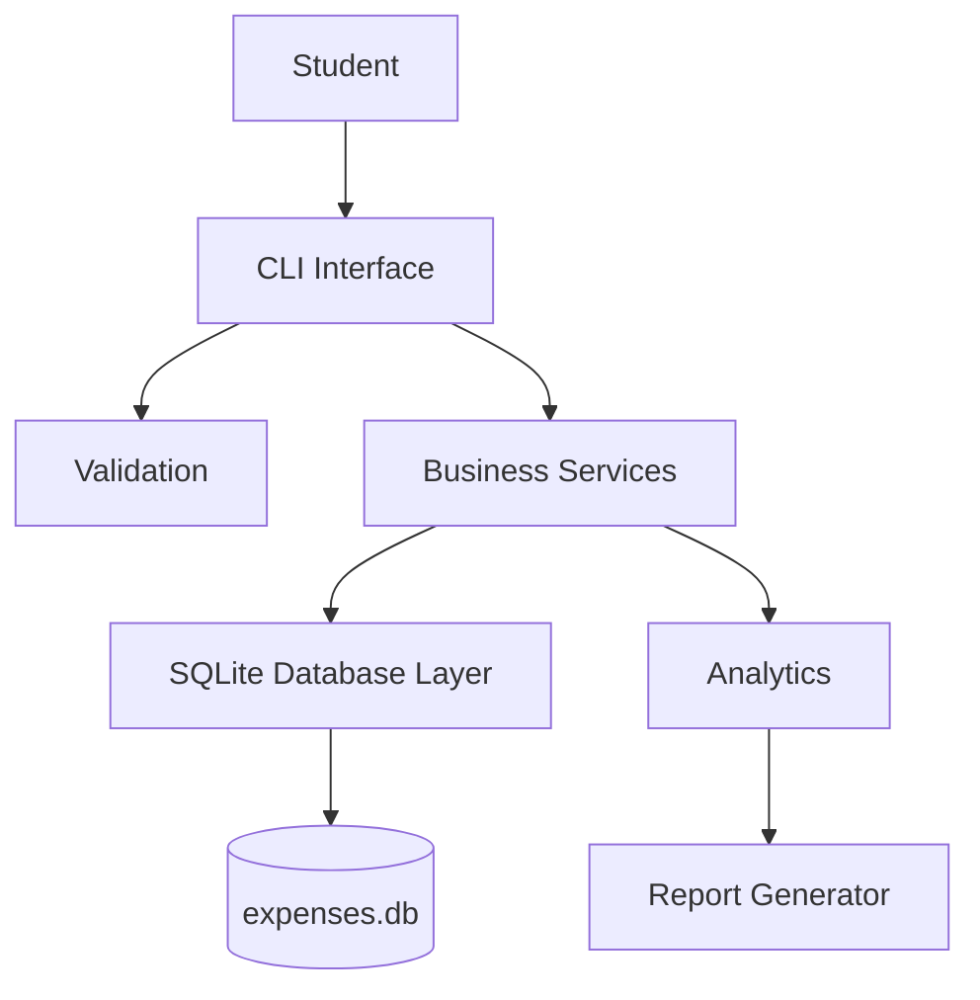
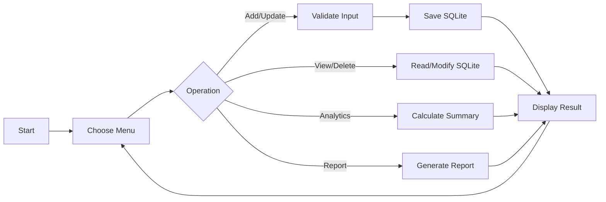
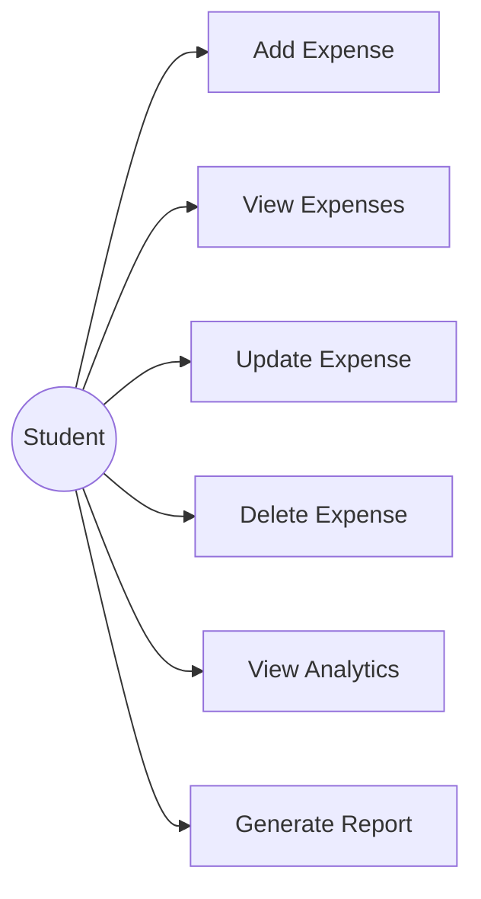
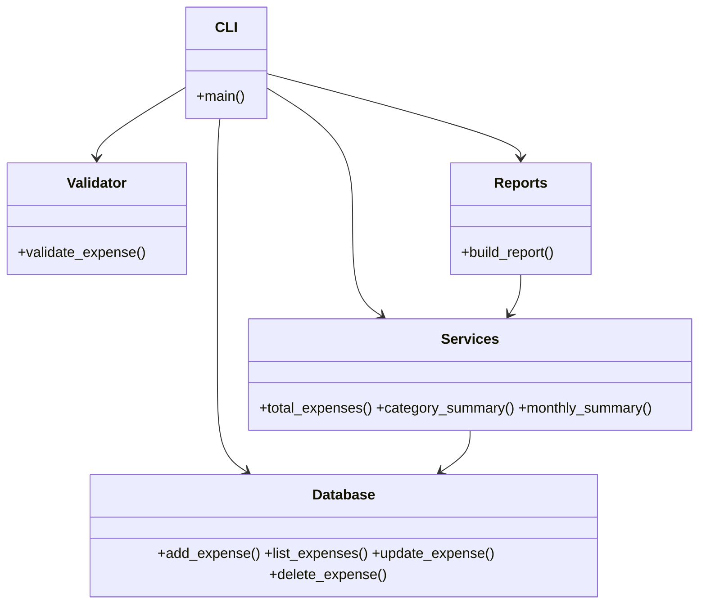
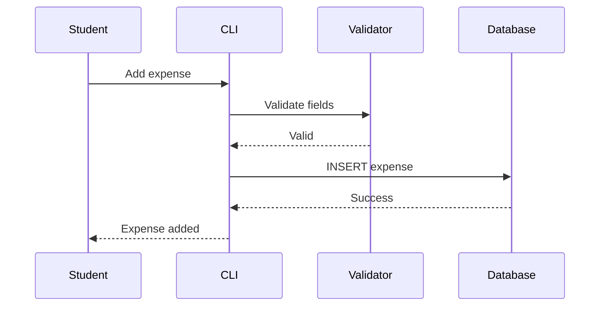
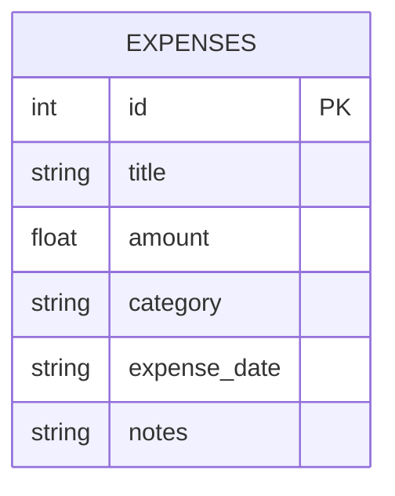

# Design Diagrams

## System Architecture

```mermaid
flowchart TD
A[Student] --> B[CLI Interface]
B --> C[Validation]
B --> D[Business Services]
D --> E[SQLite Database Layer]
D --> F[Analytics]
F --> G[Report Generator]
E --> H[(expenses.db)]
```

## Workflow

```mermaid
flowchart LR
A[Start] --> B[Choose Menu] --> C{Operation}
C -->|Add/Update| D[Validate Input] --> E[Save SQLite]
C -->|View/Delete| F[Read/Modify SQLite]
C -->|Analytics| G[Calculate Summary]
C -->|Report| H[Generate Report]
E --> I[Display Result]
F --> I
G --> I
H --> I
I --> B
```

## Use Case

```mermaid
flowchart LR
U((Student)) --> A[Add Expense]
U --> B[View Expenses]
U --> C[Update Expense]
U --> D[Delete Expense]
U --> E[View Analytics]
U --> F[Generate Report]
```

## Class / Component

```mermaid
classDiagram
class CLI { +main() }
class Validator { +validate_expense() }
class Database { +add_expense() +list_expenses() +update_expense() +delete_expense() }
class Services { +total_expenses() +category_summary() +monthly_summary() }
class Reports { +build_report() }
CLI --> Validator
CLI --> Database
CLI --> Services
CLI --> Reports
Services --> Database
Reports --> Services
```

## Sequence

```mermaid
sequenceDiagram
Student->>CLI: Add expense
CLI->>Validator: Validate fields
Validator-->>CLI: Valid
CLI->>Database: INSERT expense
Database-->>CLI: Success
CLI-->>Student: Expense added
```

## ER Diagram

```mermaid
erDiagram
EXPENSES {
 int id PK
 string title
 float amount
 string category
 string expense_date
 string notes
}
```
